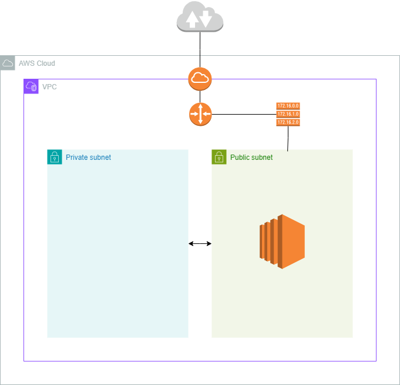

= AWS

== Accounts

* link:./accounts/accounts.adoc[Accounts]
* link:./accounts/root-user.adoc[The root user]
* link:./accounts/organizations.adoc[Organizations]
* link:./accounts/resource-access-manager.adoc[Resource Access Manager]

== Users and identity

* link:./identity/iam.adoc[Identity and Access Management (IAM)]
* link:./identity/federation.adoc[Federation]
* link:./identity/identity-center.adoc[IAM Identity Center]
* link:./identity/directory-services.adoc[Directory services]
* link:./identity/cognito.adoc[Cognito]

== User interfaces

* link:./ui/http-api.adoc[AWS HTTP API]
* link:./ui/cli.adoc[AWS CLI]
* link:./ui/web-console.adoc[AWS web console]
* link:./ui/access-keys.adoc[Access keys]

== Billing

* link:./billing/pricing-models.adoc[Pricing models]
* link:./billing/payment-models.adoc[Payment models]
* link:./billing/resource-pricing.adoc[Resource pricing]
* link:./billing/cost-management-tools.adoc[Cost management tools]

== Support

* link:./support/support-plans.adoc[Support plans]
* link:./support/support-resources.adoc[Support resources]
* link:./support/customer-enablement.adoc[Customer enablement services]

== Management, governance, and compliance tools

* link:./management/control-tower.adoc[Control Tower]
* link:./management/systems-manager.adoc[Systems Manager]
* link:./management/service-catalog.adoc[Service Catalog]
* link:./management/config.adoc[Config]
* link:./management/health.adoc[Health APIs and dashboards]
* link:./management/artifact.adoc[AWS Artifact]

== Optimization tools

* link:./optimization/trusted-advisor.adoc[Trusted Advisor]
* link:./optimization/compute-optimizer.adoc[Compute Optimizer]
* link:./optimization/launch-wizard.adoc[Launch Wizard]
* link:./optimization/well-architected.adoc[Well-Architected]
* link:./optimization/adoption-framework.adoc[Cloud Adoption Framework]

== AWS global infrastructure

* link:./infrastructure/responsibility.adoc[Shared responsibility model]
* link:./infrastructure/regions-zones.adoc[Regions and zones]
* link:./infrastructure/network.adoc[AWS global network]
* link:./infrastructure/outposts.adoc[Outposts]
* link:./infrastructure/cloudfront.adoc[CloudFront]

== Networking

This section describes how to build out the following architecture step-by-step:

1. link:./networking/vpc.adoc[Virtual Private Clouds (VPCs)]
2. link:./networking/subnets.adoc[Subnets]
3. link:./networking/resources.adoc[Resources]
4. link:./networking/gateways.adoc[Gateways]
5. link:./networking/route-tables.adoc[Route tables]
6. link:./networking/nat-gateways.adoc[NAT gateways]
7. link:./networking/nacls-security-groups.adoc[NACLs and security groups]

== Compute

* link:./compute/ec2.adoc[EC2]
* link:./compute/lightsail.adoc[Lightsail]
* link:./compute/ecs.adoc[Elastic Container Service (ECS)]
* link:./compute/batch.adoc[Batch]

== Storage

* link:./storage/categories.adoc[Storage categories: block, file, object]
* link:./storage/ebs.adoc[Elastic Block Store (EBS)]
* link:./storage/efs.adoc[Elastic File System (EFS)]
* link:./storage/s3.adoc[Simple File Storage (S3)]
* link:./storage/fsx.adoc[FSx]
* link:./storage/storage-gateway.adoc[Storage Gateway]
* link:./storage/drs.adoc[Elastic Disaster Recovery service (DRS)]

== Databases

* link:./databases/rds.adoc[RDS]
* link:./databases/aurora.adoc[Aurora]
* link:./databases/dynamodb.adoc[DynamoDB]
* link:./databases/documentdb.adoc[DocumentDB]
* link:./databases/redshift.adoc[Redshift]
* link:./databases/emr.adoc[Elastic MapReduce (EMR)]
* link:./databases/elasticache.adoc[ElastiCache]
* link:./databases/memorydb.adoc[MemoryDB for Redis]
* link:./databases/athena.adoc[Athena]
* link:./databases/glue.adoc[Glue]
* link:./databases/kinesis.adoc[Kinesis]
* link:./databases/opensearch.adoc[OpenSearch]
* link:./databases/data-exchange.adoc[Data Exchange]
* link:./databases/msk.adoc[Managed Streaming for Kafka (MSK)]
* link:./databases/data-pipeline.adoc[Data Pipeline]
* link:./databases/quicksight.adoc[QuickSight]
* link:./databases/neptune.adoc[Neptune]
* link:./databases/qldb.adoc[QLDB]
* link:./databases/managed-blockchain.adoc[Managed Blockchain]
* link:./databases/custom.adoc[Custom databases]

== DNS, auto-scaling, and load-balancing

* link:./routing/route53.adoc[Route53]
* link:./routing/auto-scaling.adoc[Auto-scaling]
* link:./routing/load-balancers.adoc[Load balancers]
* link:./routing/health-checks.adoc[Health checks]

== Application services

* link:./services/serverless.adoc[Serverless services]
* link:./services/lambda.adoc[Lambda]
* link:./services/sqs.adoc[Simple Queue Service (SQS)]
* link:./services/sns.adoc[Simple Notification Service (SNS)]
* link:./services/event-bridge.adoc[EventBridge]
* link:./services/mq.adoc[MQ]
* link:./services/step-functions.adoc[Step Functions]
* link:./services/snf.adoc[Simple Workflow Services (SWF)]
* link:./services/api-gateway.adoc[API Gateway]

== Security

* link:./security/secrets.adoc[Secrets]
* link:./security/encryption.adoc[Encryption]
* link:./security/detection.adoc[Detecting tools]
* link:./security/firewalls-ddos.adoc[Network firewalls and DDoS protection]
* link:./security/security-management.adoc[Security management]
* link:./security/penetration-testing.adoc[Penetration testing]

== Logging

* link:./logging/cloudwatch.adoc[CloudWatch Logs]
* link:./logging/cloudtrail.adoc[CloudTrail]
* link:./logging/vpc-flow-logs.adoc[VPC Flow Logs]
* link:./logging/access-logs.adoc[Access Logs]

== DevOps

* link:./devops/quick-starts.adoc[Quick Starts]

== Miscellaneous tools and services

* link:./miscellany/migration-and-transfer.adoc[Migration and transfer services]
* link:./miscellany/machine-learning.adoc[Machine learning and AI services]
* link:./miscellany/end-user-computing.adoc[End-user computing]
* link:./miscellany/iot-core.adoc[IoT Core]
* link:./miscellany/device-farm.adoc[Device Farm]
* link:./miscellany/amplify-appsync.adoc[Amplify and AppSync]
