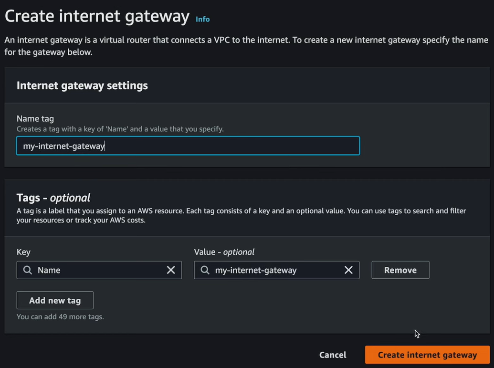
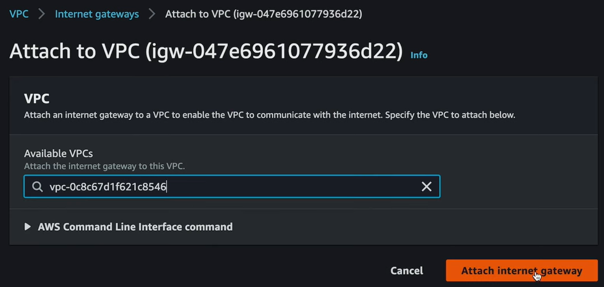

= Gateways

Once a new instance is running inside a subnet, you can select the instance from the list of EC2 instance and then click *Connect*. Choose *EC2 Instance Connect* to connect to the instance using the browser-based SSH client. The connection should not work – the expected outcome is an error messages saying "Failed to connect to your instance".

The reason is there is no route from the internet to the instance.

Resources created within different subnets within the same VPC can communicate with each other automatically. This is the default behavior. This private traffic between a VPC's subnets is represented by the two-way arrows in the network diagram at the top of this diagram. But to allow public access into a subnet and its resources, you need to create a gateway, specifically an *internet gateway*, which is represented by this symbol:

[NOTE]
======
A gateway, in general, connects one computer network to another computer network. An internet gateway connects a computer network to the internet. Other types of gateways include transit gateways and NAT gateways.
======

To crete an internet gateway, go to *VPC* > *Internet gateways* > *Create internet gateway*. Give the gateway a name, and then click *Create internet gateway*. You can only have one internet gateway per VPC.

Once the internet gateway is created, you need to attach it to the VPC. Select the internet gateway, and then click *Actions* > *Attach to VPC*. Choose the VPC you want to attach the gateway to, and then click *Attach internet gateway*.

