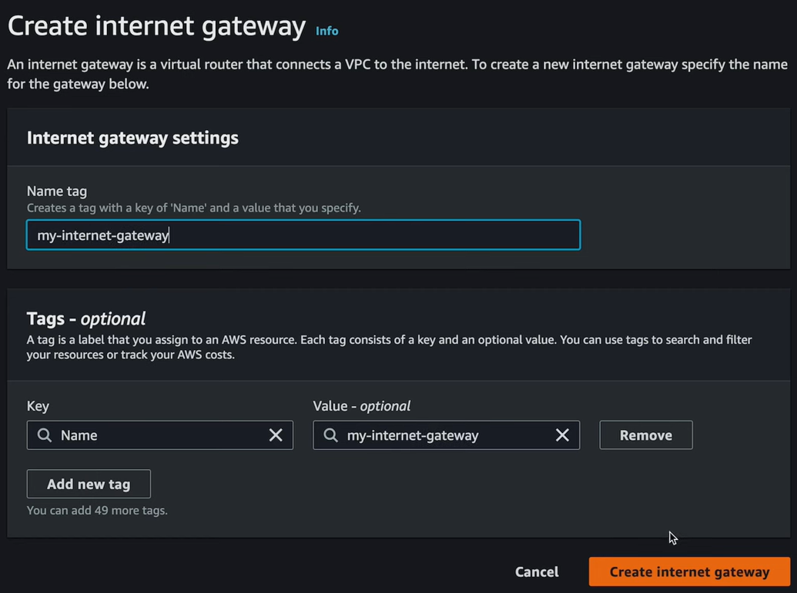

= Internet gateways

*Internet gateways* are attached to VPCs to provide a pathway between EC2 instances (and other resources) in public subnets and the internet.

Once a new instance is running inside a subnet, you can select the instance from the list of EC2 instances and then click *Connect*. Choose *EC2 Instance Connect* to connect to the instance using the browser-based SSH client. The connection should not work – the expected outcome is an error messages saying "Failed to connect to your instance".

image::../_/aws-networking-2.drawio.svg[]

The reason is there is no route from the internet to the instance.

Resources created within different subnets within the same VPC can communicate with each other automatically. This is the default behavior — private traffic between resources within a VPC's subnets works out-of-the-box. But to allow public access into a subnet and its resources, you need to create a gateway, specifically an *internet gateway*, which is represented by this symbol:

image::../_/internet-gateway.png[Symbol for an internet gateway]

[NOTE]
======
A gateway, in general, connects one computer network to another computer network. An internet gateway connects a computer network to the internet. Other types of gateways include transit gateways and NAT gateways.
======

To create an internet gateway, go to *VPC* > *Internet gateways* > *Create internet gateway*. Give the gateway a name, and then click *Create internet gateway*. You can have only one internet gateway per VPC.

Once the internet gateway is created, you need to attach it to the VPC. Select the internet gateway, and then click *Actions* > *Attach to VPC*. Choose the VPC you want to attach the gateway to, and then click *Attach internet gateway*.

image::../_/attach-internet-gateway-to-vpc.png[]

Now the infrastructure looks like this:

image::../_/aws-networking-3.drawio.svg[]

If you try again to SSH into the EC2 instance… it still won't work! This is because the subnet does not have a route to the internet gateway. You need to give the public subnet a *route* to your internet gateway. This is done using something called a *route table*…
