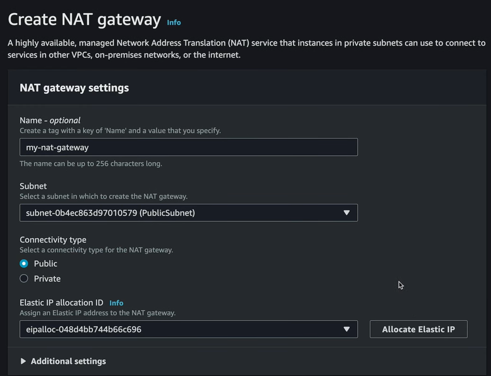

= NAT gateways

Repeat the steps above to launch an EC2 instance into the private subnet. This time, do not enable *auto-assign public IP*. Create a new security group for private resources, but allow SSH access as before.

Next, to SSH from the public EC2 instance to the private EC2 instance, you will need to upload a key pair to the public EC2 instance. You can do this using the following command:

[source,bash]
----
sudo scp -i /Users/<name>/Downloads/your-key.pem /Users/<name>/Downloads/your-key.pem ec2-user@52.203.200.115:/home/ec2-user
----

The IP address is the assigned IP address for the public EC2 instance.

Now you can SSH into the public EC2 instance from your local machine, and then SSH into the private EC2 instance from the public EC2 instance – using the same key pair both times.

Check the PEM file is in the public EC2 instance:

[source,bash]
----
cd /home/ec2-user
ls
----

Get the IP address for the private EC2 instance from the AWS Management Console, then run the following command from the public EC2 instance CLI:

[source,bash]
----
ssh -i your-key.pem ec2-user@<ip-address>
----

Now, from the context of the private server, try updating the system packages:

[source,bash]
----
sudo yum update -y
----

This will fail, because the private subnet does not have a route to the internet gateway. To allow the private subnet to access the internet, you need to create a *NAT gateway*.

A NAT gateway allows resources to reach out to the internet, but disallows incoming traffic from the internet. A NAT gateway is a *network address translation (NAT)* service that allows instances in a private subnet to connect to the internet, or other services outside the VPC, but external services cannot initiate a connection with those instances.

To create a NAT gateway, you will actually create it in your public subnet, because the public subnet has a route to the internet gateway. And then you will use your private route table to create a route to that NAT gateway.

From the VPC dashboard, go to *NAT gateways* > *Create NAT gateway*. Give it a name, choose the public subnet, set the connectivity type to public, and click the button to generate an elastic IP address. Click *Create NAT gateway*.

Next, go to *Route tables*, select your private route table, and add a route out to the new NAT gateway. For the destination, allow everything as before (`0.0.0.0/0`), and for the target, select the NAT gateway you just created.

The NAT gateway takes a few minutes to become available. Once it is available, try again to SSH into the private EC2 instance from the public EC2 instance, and then try updating the system packages. This time, it should work.
