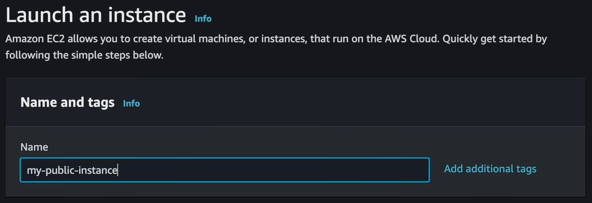
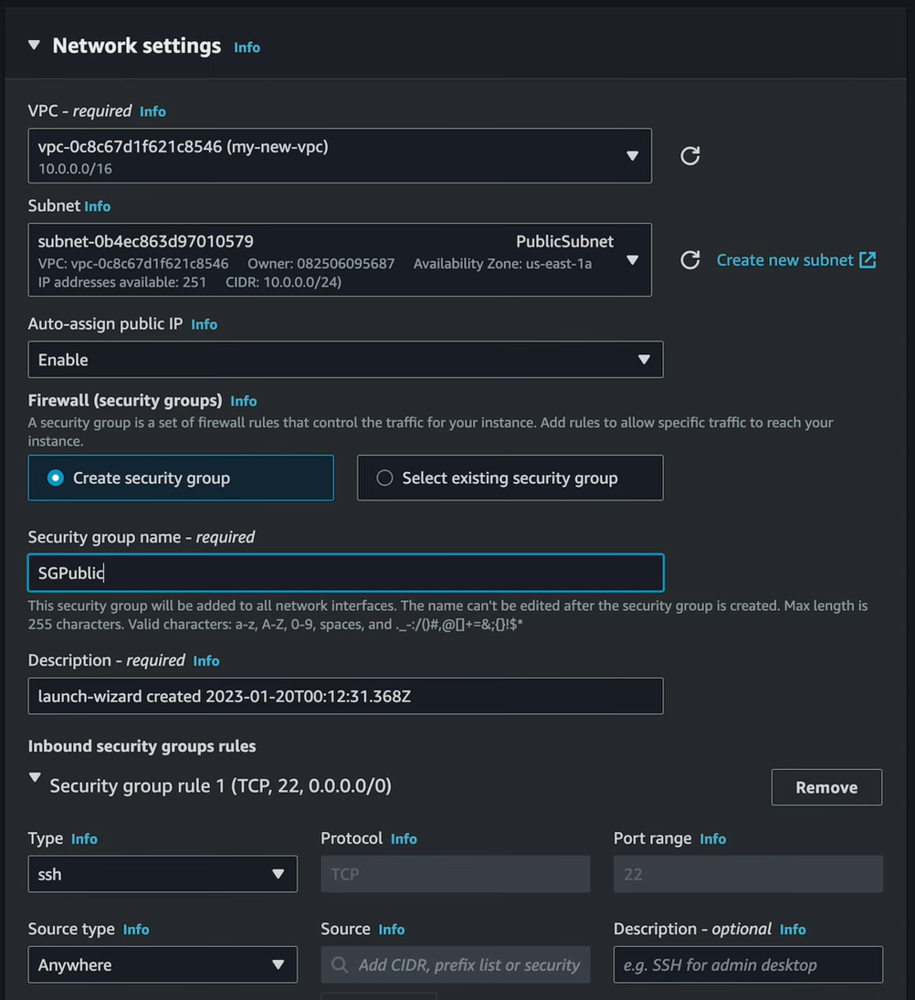

= Resources

Resources are launched into subnets. When you launch a resource, you will need to specify the subnet you want it to be launched into.

High availability can be achieved by launching redundant resources across different availability zones.

To launch an EC2 instance, go to *EC2* > *Launch instance*. Give the instance a name, choose a system image, instance type, and create a public-private key pair (if you do not already have one you can reuse).

Under *Network settings*, choose your VPC, and then choose the subnet you want to launch the instance into. For public instances, you want to choose the option to enable *auto-assign public IP*. Configure firewall settings by creating or reusing a security group. For most public resources, you will at least want an "ssh" security group rule from "anywhere".

Click *Launch instance*. You now have an EC2 instance running in your public subnet.

image::../_/aws-networking-2.drawio.svg[]
