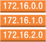
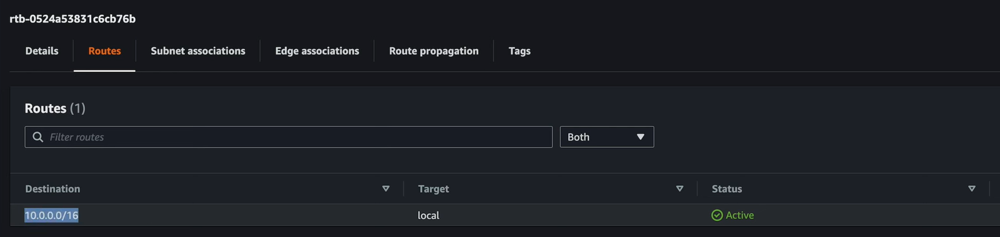
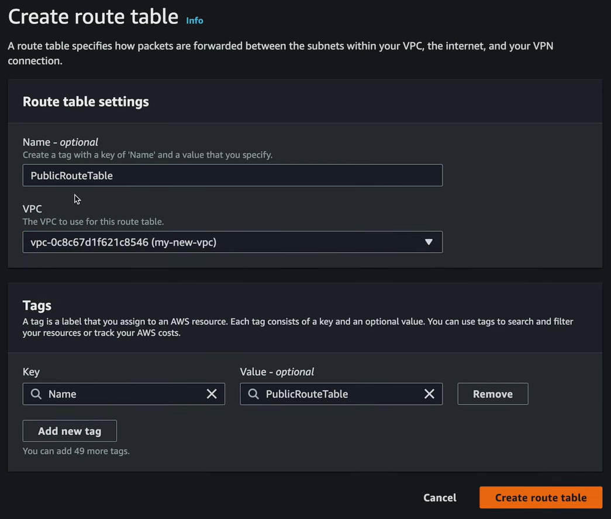

= Route tables

If you try again to SSH into the EC2 instance... it still won't work. This is because the subnet does not have a route to the internet gateway. You then need to give the public subnet a *route* to your internet gateway. This is done using something called a *route table*, which has this symbol:

And this is the symbol for a router. Every VPC has a router by default, so you don't need to explicitly set up a router. You only need to set up route tables for the subnets.

To do that, from the *VPC* dashboard go to *Route tables*. All VPC's come with default route tables, which will be listed here. The default route table is called the *main route table*. All unassociated subnets use the main route table. If you select the main route table and then view the routes within it, you will see that it has a route to the local VPC CIDR range. This is how all resources within a VPC can communicate with each other by default.

For the main route table, if you look under the *Subnet associations* tab, you will see that there are no explicit subnets associated with the main route table. This is because all subnets are associated with the main route table by default. Any subnet that is not explicitly associated with another route table will use the main route table.

We want to create separate route tables for our public and private subnets. We don't want to use the default main route table for this purpose, because we don't want to treat our public and private subnets the same way in terms of routing.

Create two new route tables, one "public" and one "private", and both associated with the VPC.

Route tables belong to VPCs, but each route table is associated with one or more subnets within that VPC. Select the public route table, and associate it with the public subnet. Repeat for the private route table and the private subnet.

To add a route between the public subnet and the internet gateway, we can now add a route to the public route table. Select the public route table, and then click *Routes* > *Edit routes*. Add a new line to the route table. For the destination, we want to allow everything, so enter the value `0.0.0.0/0`. This value covers all IP addresses - including those outside of the VPC's own CIDR range (which is used for internal traffic).

For the target, select *Internet gateway*, and then choose the internet gateway you created earlier. Click *Save changes*.

Now, if you try to SSH into the EC2 instance, it should work. This proves that you have public access to the instance via SSH. Try running a command like `sudo yum update -y`.
