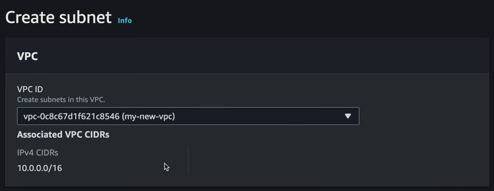

= Subnets

Within a VPC you will have isolated networks called *subnets*. A subset is a defined range of network IP addresses — an *IP space* — within a VPC's CIDR range.

Subnets are used to increase the security and efficiency of network communications. You can think of them as like postcodes, which help to route mail in a more efficient way than could be achieved using only the street address and city.

Subnets are created within a VPC. VPCs span multiple availability zones — the two or three AZs of its region — but each subnet within a VPC must be mapped to exactly one of those availability zones.

image::../_/vpc-subnet-az.drawio.svg[]

For each subnet that you create within a VPC, you give the subnet a name, choose an availability zone, and specify the subnet's IPv4 CIDR block, which must be a subset of the IPv4 CIDR range of the parent VPC.

In the below example, the IPv4 CIDR range of the VPC is 10.0.0.0/16, while the IPv4 CIDR block for the subnet is 10.0.0.0/24. It means for the subnet, only the last octet of the IP range can vary, so the subnet's range is 10.0.0.1 to 10.0.0.254.

image::../_/create-subnet-settings.png[]

In the following settings for the private subnet, the subnet's IPv4 CIDR block is set to 10.0.1.0/24. This means that the subnet's IP range is 10.0.1.1 to 10.0.1.254.

image::../_/create-subnet-settings-2.png[]

You can create one or more subnets within each VPC. What you will usually see in a VPC is a public subnet and a private subnet. The public subnet will have a route to the wider internet and its resources will therefore be accessible by the public. The private subnet will encapsulate resources that have only private IP addresses and that can be reached from outside the VPC.

image::../_/aws-networking-1.drawio.svg[]

Another common pattern is to have, within each VPC, a public subnet and a private subnet in one geographic region, and a second public-private subnet pair in a different region. Therefore, if one region goes down, you will have high availability by having a second region to failover to.
