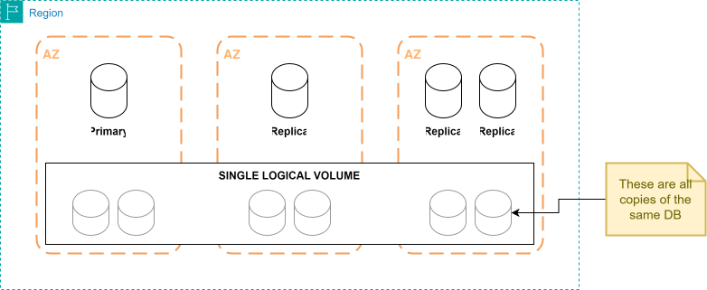

= AWS: Amazon Aurora

*Amazon Aurora* is a proprietary database system developed by Amazon. It sits
within the RDS family and is Amazon's fastest-growing cloud product.

Aurora has some great features, especially in terms of scalability and
durability. It is up to five times faster than standard MySQL databases, and up
to three times faster than standard PostgreSQL databases. It has a distributed,
fault-tolerant, self-healing storage system that auto-scales up to 128TB per
database instance.

.Key features
****
* *High performance and scalability*: Offers high performance, self-healing
  storage, scaling up to 128TB, point-in-time recovery, and continuous backup to
  S3.

* *DB compatibility*: Compatible with existing MySQL and PostgreSQL open source
  DBs.

* *Replicas*: In-region read scaling and failover targets — up to 15 read
  replicas can be created, and this can be done automatically using
  auto-scaling.

* *Global database*: Cross-region cluster with read scaling for fast replication
  and low latency needs. It is possible to failover to a secondary instance in
  another region.

* *Multi-master*: Aurora MySQL multi-master allowed multiple writer instances
  in a region. CAUTION: AWS has deprecated this feature — it's no longer
  offered for new clusters, so don't rely on it in new designs.

* *Serverless*: On-demand, auto-scaling configuration. There are two
  generations, with quite different capabilities:
+
--
** *Serverless v1* (the original version): does not support read replicas or
   public IPs, and can be accessed only through a VPC or Direct Connect (not a
   VPN). The database fully pauses when idle and resumes on the next
   connection.
** *Serverless v2* (current generation): scales instantly and granularly based
   on load, supports read replicas, Global Database, and normal VPC networking,
   and can be mixed with provisioned instances in the same cluster. It doesn't
   fully pause to zero capacity the way v1 does. For new projects, use
   Serverless v2.
--
****

There must be a single primary database instance, which is the only instance
that can be written to, and it will immediately update all read replicas. Aurora
can scale out read requests through *read replicas*. *Auto-scaling* can be
enabled, to create read replicas automatically based on usage. The replicas can
be in other availability zones, but they must always be in the same region as
the primary.

Fault tolerance is achieved by creating a _single logical volume_ across three
availability zones. In a disaster recovery scenario, a replica can be promoted
to the primary, or a new primary can be created from a backup.

.Replication comparison: Aurora versus MySQL
|===
|- |Aurora |MySQL

|Number of replicas
|≤ 15
|≤ 5

|Performance impact on primary
|Low
|High

|Replica location
|In-region
|Cross-region

|Act as failover target
|Yes (with no data loss)
|Yes (but potential for minutes of data loss)

|Automatic failover
|Yes
|No

|Support for user-defined replication delay
|No
|Yes

|Support for different data or schema versus the primary
|No
|Yes
|===
