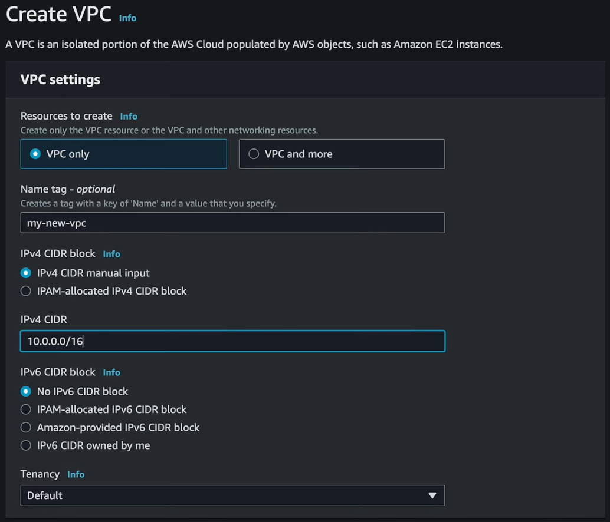

= AWS networking: CIDR range

When you sign up for a new AWS account, a default VPC will be created automatically for your account. Typically, the IPv4 CIDR range of the default VPC will be `172.31.0.0/16`.

When you create further VPCs, you will define new IPv4 *CIDR ranges* for each one.

CIDR is an acronym for *Classless Inter-Domain Routing*. A CIDR range is a notation that specifies a range of IP addresses. It is used to define the range of IP addresses that is reserved for use by resources within a VPC.

It is strongly RECOMMENDED that each VPC has a unique CIDR range, and that there be no overlap with the CIDR ranges of other VPCs in the same region (and associated with the same account). Likewise, in hybrid clouds, the IP spaces of VPCs in the public cloud should not conflict with the IP spaces of on-premises resources, to guarantee that everything can talk to everything else. Overlapping CIDR blocks can also create routing problems for some services, like AWS Transit Gateway.

Resources launched into a VPC can be assigned IP addresses from the VPC's CIDR range, for the purpose of routing traffic.

The CIDR range notation looks like this:

* `10.0.0.0/24`
* `10.0.0.0/16`
* `10.0.0.0/8`

The digits between the dots are octets, ie. 8-bit integers between 0 and 254.

The number after the slash is the number of bits that are fixed in the range. So if you see `/24` on the end, this means that the first three octets (8 + 8 + 8 = 24) are fixed, and the last octet can be any number between 0 and 254. If you see `/16` on the end, it means the first two octets are locked, and `/8` means only the first octet is locked.

|===
|CIDR range |Min IPv4 |Max IPv4

|`10.0.0.0/24`
|`10.0.0.1`
|`10.0.0.254`

|`10.0.0.0/16`
|`10.0.0.1`
|`10.0.255.254`

|`10.0.0.0/8`
|`10.0.0.1`
|`10.255.255.254`
|===

Inputting `10.0.0.0/16` for your CIDR range will give you 65,536 possible IP addresses, in the range `10.0.0.1` to `10.0.255.254`. The default CIDR range for an account's default VPC, `172.31.0.0/16`, also gives 65,536 possible IP addresses from `172.31.0.1` to `172.31.255.254`. These will be more than sufficient for most networking requirements.

[TIP]
======
Use online tools like the https://www.calculator.net/ip-subnet-calculator.html[IP Subnet Calculator] to help you calculate the CIDR ranges for your VPCs and subnets.
======

== RFC1918 range

Looking at the CIDR range for the default VPC again, `172.31.0.0/16`, we can think of this as being an IP range of two halves. The first half, the first two octets, `172.31`, are fixed and they describe the _network_. The last two octets, `0.0`, describe the _host_ (or the actual system that's on the network).

The network part of the CIDR range comes from the RFC1918 standard, which defines the private IP address ranges. These are the ranges that are reserved for private networks, and are not routable on the public internet. These ranges are:

* `10.0.0.0/8`
* `172.16.0.0/12`
* `192.168.0.0/16`

The purpose of using RFC1918 IP address for private networks is to avoid conflicts with public resources on the internet. If you create an IP conflict with something on the internet, you won't be able to talk to that thing.

== IPv6

AWS also supports use of IPv6 addresses for private networking in VPCs. But AWS has implemented IPv6 networking as a *dual stack*, which means the IPv6 addresses are overlaid on the IPv4 addresses. So, if you use IPv6, every network and each instance will have both an IPv4 and an IPv6 address.

For IPv6, there are fixed sizes for CIDR ranges for VPCs and subnets:

* `/56` for VPCs (= 4,722,366,482,869,645,213,696 possible addresses)
* `/64` for subnets (= 18,446,744,073,709,551,616 possible addresses)
