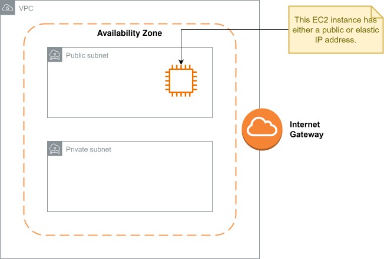

= AWS networking: IP addresses

When we launch instances and other resources into VPC subnets, we assign them IP
addresses.

There are three types of IP address in AWS:

* Public IP addresses
* Private IP addresses
* Elastic IP addresses

== Public IP addresses

Public IP addresses are used for resources launched into public subnets. When
you launch a resource into a public subnet, AWS will automatically assign a new
public IP address to the resource (unless you specify use of an elastic IP
address). You don't get any control over which public IP addresses are assigned
to your instances — it's automatic.

Public IP addresses are used to connect _into_ resources from the internet. They
are not used for communication between resources within a VPC, and they are
assigned only to resources within public subnets.

Public IP addresses will be lost when the instance is dropped (but they are
retained when instances are simply rebooted). Also, public IP addresses cannot
be moved from one instance to another.

CAUTION: Since February 1, 2024, AWS charges an hourly rate (around
$0.005/hour) for _every_ public IPv4 address — auto-assigned public IPs and
Elastic IPs alike — whether or not the address is attached to a running
resource. Public IPv4 addresses are no longer free of charge; only private IP
addresses and IPv6 addresses remain free.

== Private IP addresses

An instance launched into a public subnet has both a public IP address and a
private IP address. An instance's public and private IP addresses are associated
with each other.

An instance's public IP address is used to communicate with the instance from
outside the VPC. Its private IP address is used for communication from other
resources within the VPC.

Thus, every resource within a VPC has a private IP address. Instances launched
into a private subnet will have only a private IP address, and not a public (or
elastic one). You cannot assign public or elastic IP addresses to resources
launched into private subnets.

An instance's private IP address is allocated from the CIDR range of the subnet
into which it is launched.

As with public IP addresses, an instance's private IP address is retained
between restarts.

Private IP addresses are also free of charge.

== Elastic IP addresses

This is Amazon's name for *static public IP addresses*. You rent them from AWS,
and they are not automatically assigned to resources. If you assign an elastic
IP address to a resource, and then later drop the resource, the elastic IP
address will be returned to your account's pool of available elastic IP
addresses. You can then reuse the static IP address for new resources.

With elastic IP addresses, you also have the flexibility to move the addresses
between EC2 instances (and also Elastic Network Adapters).

As with standard public IP addresses, static public addresses are associated
with the corresponding private IP addresses of the instances to which they are
assigned.

As of February 2024, AWS charges for _all_ public IPv4 addresses, whether
they're in use or idle (see the caution note above) — the older model, where
you were only charged for an unattached/idle Elastic IP address, no longer
applies. The current flat per-address charge is intended to reflect the
scarcity of public IPv4 addresses generally, not just to discourage hoarding of
unused ones.

Static IP addresses can be useful where you want to have a fixed address for a
resource, for example for the purpose of allow-listing a resource in a firewall
configuration. However, generally you want to avoid depending on static IP
address, and instead use DNS names that can be resolved to different addresses.

