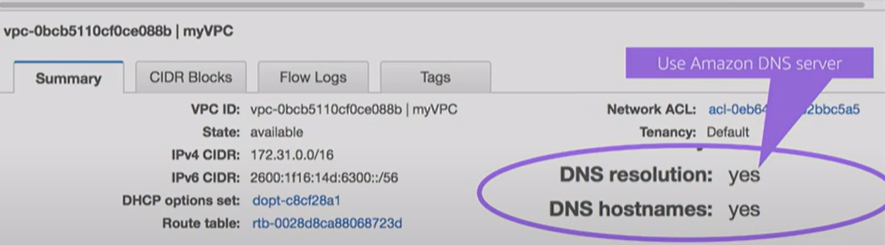

= VPC DNS options

AWS provides DNS services within VPCs, too. These services are switched on by default, although you can switch them off — and there are use cases where doing so can help to improve the security of your virtual private networks.

The AWS DNS service provides two things:

* *DNS resolution*: This feature allows instances inside a VPC to resolve public addresses, and also addresses of other things in the VPC.

* *DNS hostnames*: This feature allows DNS host names to be auto-assigned to EC2 instances in the VPC, so you don't have to use IP addresses to connect to them.
