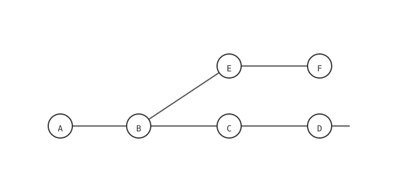

= Session management

An innovation in Pi's architecture is the design of sessions as trees rather than a flat hierarchy. With the `/tree` command, you can jump back to an earlier message, edit it, then resubmit. This creates a new branch in the session tree. The original path is maintained in the same session file.

When we create forks in the session history, we're not also changing the code - it's not Git! We're just changing the conversation history. To undo changes in code, you should use Git, or a Pi extension that implements checkpoints (another feature not natively supported by Pi).

When switching branches, Pi can optionally summarize the abandoned branch so its context isn't lost.

== CLI session control

[cols="1,3", options="header"]
|===
| Flag | Description
| `-c` | Continue the most recent session.
| `-r` | Browse and select from previous sessions.
| `--name "name"` | Assign a display name to the current session.
| `--session <id>` | Open a specific session by its ID or path.
| `--fork <id>` | Fork a session into a new one.
| `--no-session` | Ephemeral mode - nothing is saved.
|===

== Internal session commands

While in interactive mode, use the following commands to manage your history:

* `/new`: Start a fresh session.
* `/resume`: Resume a previous session.
* `/name <name>`: Set the display name.
* `/session`: Show current session info and token usage.
* `/tree`: View the session hierarchy.
* `/fork`: Create a branch from an earlier user message.
* `/clone`: Duplicate the active branch into a new session.
* `/compact [prompt]`: Summarize older context.
* `/export [file]`: Export the session as HTML.
* `/share`: Upload the session as a private GitHub gist.

== Storage and format

Sessions and configuration are stored locally in `~/.pi/agent/`; this directory persists after uninstalling the Pi binary. Session files are JSONL (one JSON object per line), organized by working directory:

----
~/.pi/agent/sessions/--<path>--/<timestamp>_<uuid>.jsonl
----

The first line is a header (metadata); every later entry carries an `id` and `parentId`, which is how the tree - and in-place branching - is represented within a single file. The format evolved v1 (linear) -> v2 (tree) -> v3 (current); older sessions auto-migrate on load.
